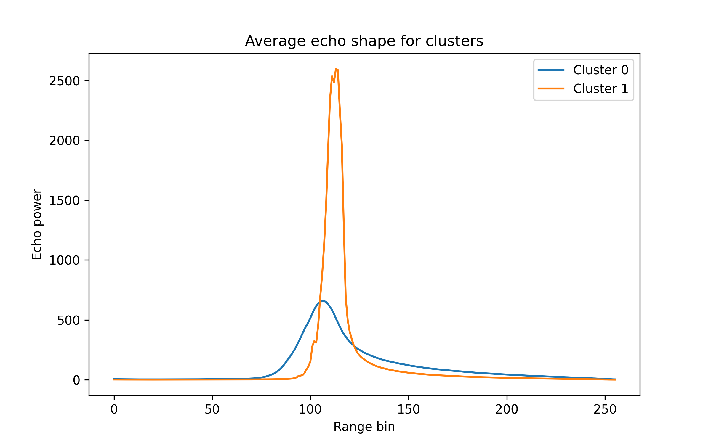
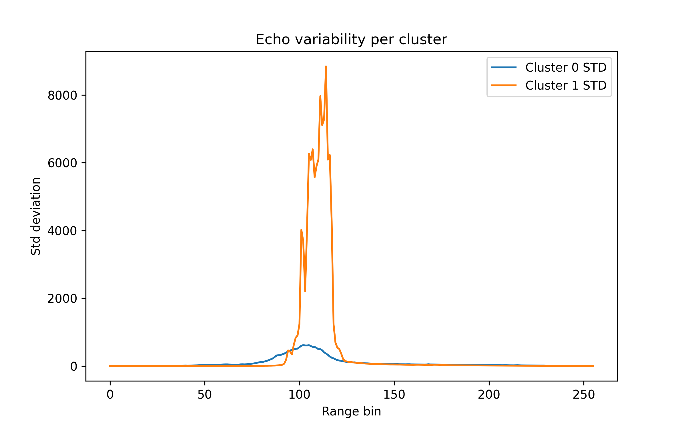
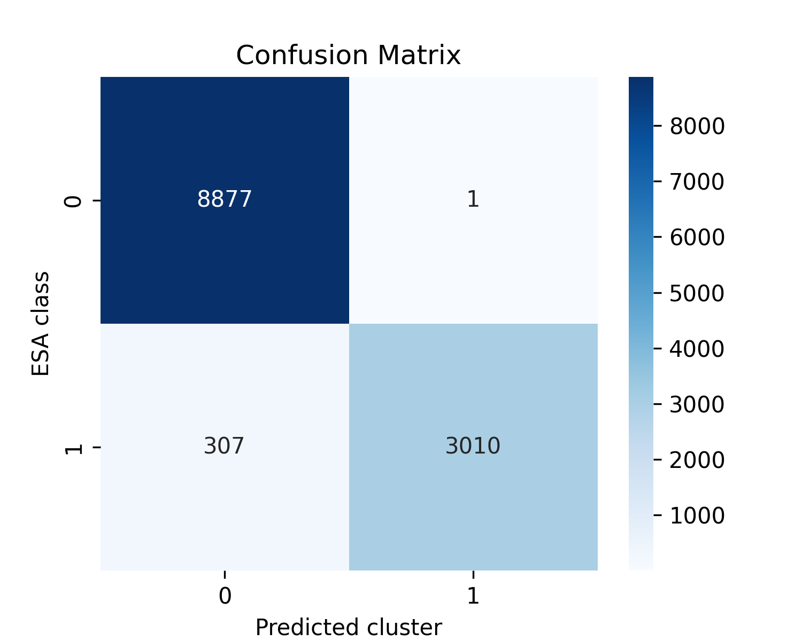

# Week4_Unsupervised_Echo_Classification
Week 4 GEOL0069 – Unsupervised classification of radar altimetry echoes into sea ice and lead classes.
# Week4_Unsupervised_Echo_Classification

Week 4 GEOLO069 – Unsupervised classification of Sentinel-3 radar altimetry echoes into **sea ice** and **lead** classes.

## Objective
The aim of this project is to classify radar altimeter echoes using **unsupervised machine learning**. Sentinel-3 Synthetic Aperture Radar (SAR) altimeter waveforms are analysed to distinguish between two surface types found in polar regions:

- Sea Ice  
- Leads (open water within sea ice)

The ESA classification included with the dataset is used only for **evaluation**, not for training.

---

## Dataset
The dataset consists of **radar altimeter waveforms** measured by the Sentinel-3 satellite.  
Each waveform represents the returned radar power as a function of range bin.

Different surface types produce different echo shapes:

- **Leads** → strong specular reflections producing sharp peaks  
- **Sea ice** → diffuse scattering producing broader echoes

---

## Feature Extraction
Three physical features were extracted from each waveform:

- **σ₀ (sigma0)** – radar backscatter coefficient describing surface reflectivity  
- **PP (Peakiness)** – measure of the sharpness of the waveform peak  
- **SSD (Stack Standard Deviation)** – variability of the waveform

These features capture the physical differences between specular and diffuse scattering surfaces.

---

## Method
The extracted features were **normalized** and clustered using:

**K-Means clustering (K = 2)**

The algorithm separates radar echoes into two clusters corresponding to sea ice and leads based solely on statistical differences in the waveform features.

---

## Results
The clustering results were compared with the official ESA classification.

Confusion Matrix:

```
[[8877    1]
 [ 307 3010]]
```

Accuracy:

**97%**

This high agreement indicates that the selected waveform features effectively distinguish between sea ice and leads.

---

## Example Figures

### Mean Echo Shape per Cluster


### Echo Standard Deviation


### ESA vs Machine Learning Classification


---

## Repository Contents

```
week4_echo_classification.ipynb   – Main analysis notebook
README.md                         – Project description
mean_echo_shape.png               – Mean waveform per cluster
echo_std.png                      – Standard deviation of echoes
confusion_matrix.png              – ESA vs ML classification comparison
```

---

## Conclusion
Unsupervised clustering based on waveform features successfully separates radar echoes produced by sea ice and leads. The strong agreement with the ESA classification demonstrates that physical waveform properties such as peakiness and backscatter provide reliable indicators of surface type in radar altimetry observations.
